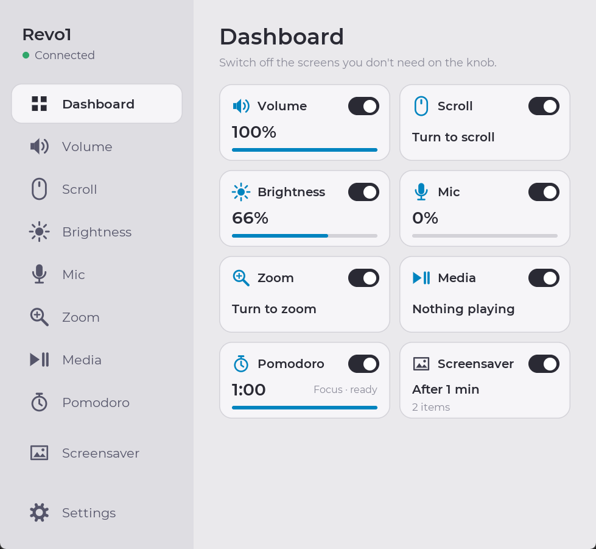
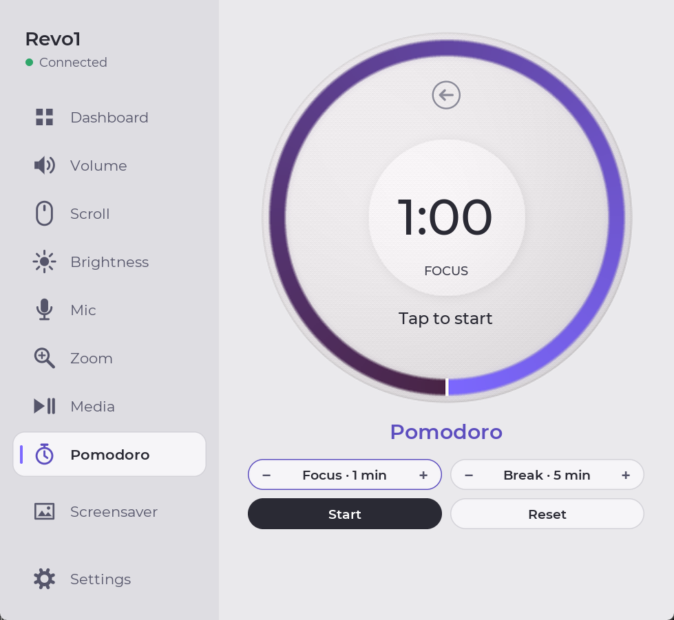
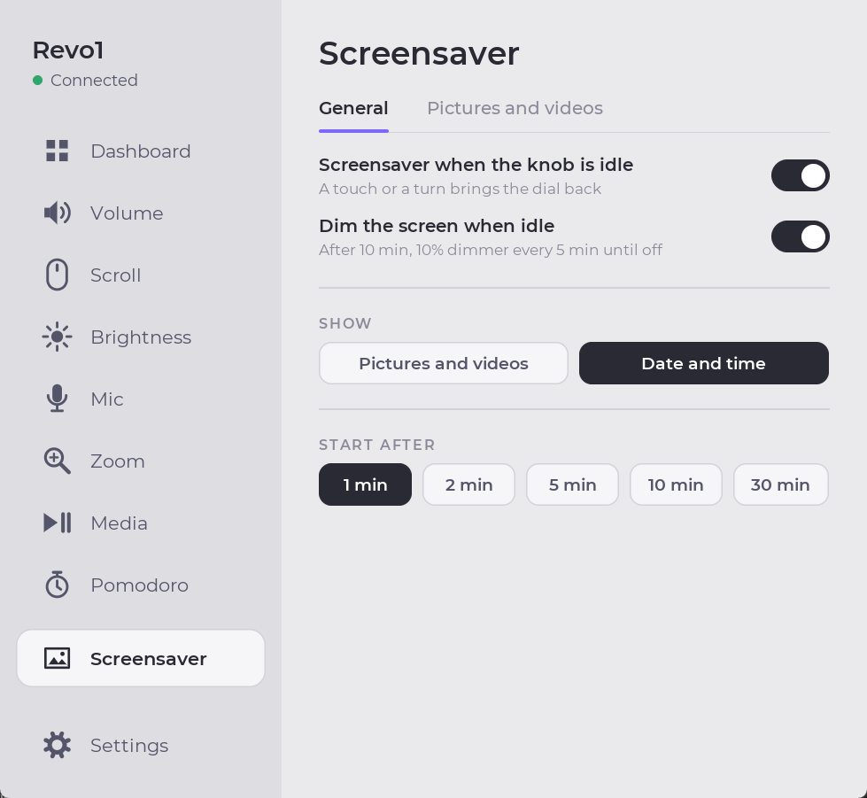

# Revo1

**Turn a Waveshare round knob display into a beautiful volume, scroll,
brightness and media controller, Pomodoro timer and photo frame for Windows.**

[](https://github.com/guilhermelimait/Revo1/actions/workflows/ci.yml)
[](LICENSE)

[](https://ko-fi.com/guilhermelimait)

Revo1 is custom firmware for the
[Waveshare ESP32-S3-Knob-Touch-LCD-1.8](https://www.waveshare.com/wiki/ESP32-S3-Knob-Touch-LCD-1.8)
([Amazon](https://link.amazon/B061NfG3G); a 360 x 360 round touch screen
with a rotary knob) plus a Windows
companion app. The screen and the app draw the same Nest-style dial: a light,
sculpted face with a glowing arc in the control's colour, and they stay in
sync as you turn the knob.

<table>
  <tr>
    <th>Dashboard</th>
    <th>Pomodoro</th>
  </tr>
  <tr>
    <td></td>
    <td></td>
  </tr>
  <tr>
    <th>Volume</th>
    <th>Media</th>
  </tr>
  <tr>
    <td></td>
    <td></td>
  </tr>
  <tr>
    <th>Menu</th>
    <th>Settings</th>
  </tr>
  <tr>
    <td></td>
    <td></td>
  </tr>
  <tr>
    <th>Screensaver</th>
    <th></th>
  </tr>
  <tr>
    <td></td>
    <td></td>
  </tr>
</table>

*Screenshots of the Windows app; the device shows the same dial.*

## Features

- **Seven screens:** system volume, mouse-wheel scrolling, display brightness,
  microphone level, zoom (Ctrl + wheel), media playback and a Pomodoro timer.
- **Dashboard:** every screen at a glance with its live value, and a switch
  to hide the ones you don't use from the knob's menu and swipes.
- **Pomodoro:** pick the focus and break lengths, then tap the dial (on the
  knob or in the app) to start or pause. The ring counts down on the knob,
  and the PC plays a chime when it's time for a break and when the break
  ends.
- **Screensaver:** add pictures (JPEG, PNG, BMP, WebP, ...), animated GIFs
  or short videos (MP4, MOV, AVI, MKV, WebM). Revo1 crops them to the round
  screen and stores them on the knob (up to about 12.9 MB), which shows them
  in rotation after the minutes of idle time you choose. Or show the **date
  and time** instead, with a ring of second marks. A touch or a turn brings
  the dial back.
- **Screen backlight** adjustable from the app, and optional **idle dimming**:
  after 10 minutes without a touch or a turn the backlight drops by 10 points
  every 5 minutes until the screen is off, and comes straight back on the
  next touch or turn.
- **Media screen** for whatever is playing (Spotify, a browser tab, ...):
  title, artist, progress ring, and big play/pause, previous and next buttons.
  Turning the knob seeks 5 seconds per click.
- **Radial menu:** tap the centre or the back icon, turn to choose, tap to
  confirm. It opens on the control you used last.
- **Always in sync:** the knob, the screen and the app window show the same
  value, and volume changes made elsewhere in Windows show up on the knob.
- **Personalise it:** one colour per control or a single colour of your
  choice, four sizes for the big number, and screen orientation in 90 degree
  steps.
- **A real Windows app:** a one-click installer, Start Menu entry, optional
  start at sign-in, and a clean uninstall. It remembers all settings between
  runs, and can minimise to the notification area.
- **Updates from the app:** the About page shows the newest release on GitHub
  and installs its firmware on the knob with one click.

## What you need

- A **Waveshare ESP32-S3-Knob-Touch-LCD-1.8**
  ([buy on Amazon](https://link.amazon/B061NfG3G)) and a USB-C data cable.
- **Windows 10 or 11** (x64 or ARM64). Nothing else: Python is bundled.

*The Amazon link is an affiliate link: as an Amazon Associate I earn from
qualifying purchases, at no extra cost to you.*

## Get started

### 1. Install the app

Download **`Revo1-Setup-<version>.exe`** from the
[latest release](https://github.com/guilhermelimait/Revo1/releases/latest)
and run it. (On a Windows on ARM PC, `Revo1-Setup-<version>-arm64.exe`
is the native build; the regular one works too.)

- It installs for your user only, so no administrator prompt, into
  `%LOCALAPPDATA%\Programs\Revo1`.
- It adds **Revo1** to the Start Menu and, if you keep the box ticked,
  starts it when you sign in.
- Installing a newer version over it closes the running app and keeps your
  settings. Remove it any time from **Settings > Apps > Installed apps**.

The installer is not code-signed yet, so Windows SmartScreen may say
"Windows protected your PC". Click **More info > Run anyway**.

### 2. Flash the firmware (once)

Download `revo1-firmware-<version>.bin` from the same release, and this
repository (**Code > Download ZIP**) for the flashing script.

The knob's single USB-C socket reaches a **different chip depending on which
way round the plug is inserted**. Revo1 needs the ESP32-S3, which
Windows lists as a *USB Serial Device* (USB ID `303A:1001`). If it shows up as
a *CH340* port instead, unplug the cable, turn the plug over and plug it back in.

In PowerShell, in the downloaded folder:

```powershell
powershell -ExecutionPolicy Bypass -File .\scripts\flash-firmware.ps1 -Firmware <path to revo1-firmware-*.bin>
```

The script finds the device, downloads Espressif's standalone `esptool` the
first time (no Python needed), **saves a full backup of the current flash** to
`backups\` before the first Revo1 flash, and then writes Revo1.
To go back to the original Waveshare firmware later:

```powershell
powershell -ExecutionPolicy Bypass -File .\scripts\flash-firmware.ps1 -Restore .\backups\flash-backup-COM9.bin
```

(Use your own backup file name. Keep it: it is the only copy of the stock
firmware.)

Then start Revo1 from the Start Menu: the sidebar shows **Connected**
once the knob answers.

## Using it

**On the device**

- **Turn** the knob to change the current control.
- **Swipe** left or right to switch to the next or previous control (you can
  turn this off in **Settings > Controls**).
- **Tap the back icon** at the top (or the centre) to open the menu. Turn to
  move the highlight, then tap to confirm, or tap an icon directly.
- On the **Pomodoro** screen, tap the dial to start or pause the timer.
- While the **screensaver** runs, or when idle dimming has turned the
  screen off, a touch or a turn wakes the dial (that first touch or turn
  does nothing else).
- On the **media** screen, tap play/pause, previous or next.

The knob has no push button.

**In the app**

The dial in the window mirrors the device and accepts clicks the same way.
The app opens on the **Dashboard**: click a tile to open that screen, or its
switch to show or hide it on the knob (at least one stays on). Pick a control
in the left sidebar.

- **Pomodoro:** set the focus and break minutes with **-** / **+** (or turn
  the knob while the timer is stopped), then **Start**, **Pause** or
  **Reset**. The timer runs in the app, so keep Revo1 running (it can sit
  in the notification area).
- **Screensaver:** on the **General** tab, switch it on, choose what to
  **Show** (**Pictures and videos**, or **Date and time**, which follows the
  PC's clock and its 12/24-hour format) and **Start after** (idle minutes),
  and turn **Dim the screen when idle** on or off. On the **Pictures and
  videos** tab choose **Show each picture for**, then **Add pictures or
  videos...**. Hover a thumbnail
  and click the cross to remove it. **Send to knob** copies the collection
  to the device (about 110 KB/s, so a full collection takes about two
  minutes); the line under the buttons says whether the knob is up to date.
  Videos keep their first 20 seconds at 10 frames per second. The first time
  you add a video, Revo1 asks to download FFmpeg (an LGPL build, about
  80 MB, into `%LOCALAPPDATA%\Revo1\tools`) to read it; if `ffmpeg` is
  already on your `PATH`, that one is used.

**Settings** has four tabs:

- **Device:** the screen backlight, the name shown in the sidebar and the
  list of connected knobs
  (refreshed automatically every two seconds; pick one or leave it on
  **Automatic**).
- **Controls:** the screen orientation (0, 90, 180 or 270 degrees) and
  **Knob direction**: **Invert scroll** and **Invert zoom** swap what a
  clockwise turn does (the comet on the dial still follows your hand). Under
  **Touch**, **Swipe between screens** turns the left/right swipe on the knob
  on or off.
- **Interface:** **Standard** colours (one per control), a swatch, or
  **Custom...** for any single bar colour; and the number size (Small, Medium,
  Large or X-Large). Under **Window**, turn on **Minimise to the notification
  area** to hide Revo1 next to the clock when you minimise it (click the
  icon to bring it back, right-click for **Quit**). When it's on, the
  start-at-sign-in shortcut starts it there too.
- **About:** links to GitHub, the releases, the licence and Ko-fi; the app
  version, the firmware version on the knob, and the latest release on
  GitHub. When the release has newer firmware than the knob, **Update
  firmware** downloads and flashes it (the first time it also downloads
  Espressif's standalone `esptool`, about 65 MB); keep the cable plugged in
  until it says it's done. **Install from file...** flashes a
  `revo1-firmware-x.y.z.bin` you downloaded or built yourself; it's always
  there while a knob is connected, and it refuses files that aren't a Revo1
  image. **Update app** opens the release page when there's a newer
  installer.

Settings are saved in `%LOCALAPPDATA%\Revo1\settings.json` straight
away. The knob also remembers its last control, orientation, colour, number
size, backlight, visible screens, swipe, dimming and screensaver settings, so
it comes back the same way after a restart, even before the app is running. Volume, microphone and brightness levels are always read from Windows,
never overwritten with old saved values.

## Troubleshooting

- **"Waiting for companion firmware".** The app found a serial port but no
  Revo1 firmware answered. Flash the firmware (step 2), and check you
  are on the ESP32-S3 side of the USB-C plug.
- **"Not connected" and no device in Settings.** Turn the USB-C plug over, or
  try another cable (some cables only charge).
- **Turning the knob changes nothing.** The screen only shows what the PC
  sends, so the app must be running. The control may also already be at its
  limit (brightness is often at 100%): turn the other way.
- **Brightness does nothing.** Brightness is set through Windows' WMI
  interface, which normally covers built-in laptop screens only. Most external
  desktop monitors are not supported yet.
- **Song titles show "?".** The device fonts only have Latin letters. Accents
  are removed ("Musica" for "Música"); other scripts, such as Japanese,
  show as "?".

## Limitations

- Windows only (it uses Windows audio, brightness and media APIs).
- Brightness works on screens Windows can dim through WMI (usually laptops).
- No album artwork yet: the serial link is line-based text.
- The Pomodoro timer and its chime run in the app: the knob shows the time
  but doesn't count on its own.
- The knob has no clock battery: the date and time screensaver starts once
  the app has connected after the knob was powered on.
- Video playback on the knob is 10 frames per second, without sound.

## Development

Needs Python 3.10 or newer.

```powershell
python -m pip install -r requirements.txt
python -m revo1                        # run from source
.\packaging\build.ps1                         # Revo1.exe + installer in dist\
```

- `packaging/build.ps1` bundles the app with PyInstaller
  (`packaging/Revo1.spec`) and wraps it with
  [Inno Setup 6](https://jrsoftware.org/isinfo.php)
  (`packaging/Revo1.iss`). The installer matches the architecture of the
  Python that builds it. `packaging/make_icon.py` regenerates the app icon
  from the dial renderer.

- `revo1/` is the Windows app (Tk + Pillow). `dial.py` is a Python copy
  of the firmware's dial renderer, so the window matches the screen pixel for
  pixel; keep it in step with `firmware/main/main.c`.
- `firmware/` is the ESP-IDF / PlatformIO project; see
  [firmware/README.md](firmware/README.md) for how to build it and how the
  renderer, encoder and touch handling work.
- GitHub Actions checks the code and builds the installers and the firmware on
  every push. Pushing a `v*` tag publishes a release with
  `Revo1-Setup-<version>.exe`, the ARM64 installer and the merged
  firmware image.

## Protocol

USB serial: 115200 baud, ASCII lines terminated by `\n`.

| Direction | Message | Meaning |
| --- | --- | --- |
| Device to PC | `HELLO,REVO1,1` | Companion handshake |
| Device to PC | `VERSION,<x.y.z>` | Firmware version, right after each `HELLO` |
| Device to PC | `SYNC` | Sent with `HELLO` until the first `STATE` after a restart; the app resends style and state |
| Device to PC | `ROT,<signed steps>` | Knob movement |
| Device to PC | `MENU` | Centre or back-icon tap opens the menu |
| Device to PC | `TAP,<0..6>` | Menu choice confirmed (mode index) |
| Device to PC | `CURSOR,<0..6>` | Knob moved the menu highlight (mode index) |
| Device to PC | `SWIPE,LEFT` or `SWIPE,RIGHT` | Change control |
| PC to device | `STATE,<MODE>,<0..100>,<0\|90\|180\|270>` | Set screen state |
| PC to device | `SHOWMENU` | Show radial menu |
| PC to device | `COMETRESET` | Put the scroll/zoom comet back at its start (sent on connect) |
| PC to device | `STYLE,<STANDARD\|RRGGBB>,<24\|32\|40\|48>` | Bar colour and number size |
| Device to PC | `MEDIA,PREV\|PLAYPAUSE\|NEXT` | Transport icon tapped |
| PC to device | `TRACK,<title>` | Now-playing title |
| PC to device | `ARTIST,<artist>` | Now-playing artist |
| PC to device | `PLAY,<0\|1\|2>,<position s>,<duration s>` | Playback state (0 stopped, 1 playing, 2 paused) |
| PC to device | `SCREENS,<mask>` | Screens shown on the knob (bit n = mode n); answered by `SCREENS_OK,<mask>` |
| PC to device | `BACKLIGHT,<5..100>` | Backlight percent; answered by `BACKLIGHT_OK,<percent>` |
| PC to device | `SWIPES,0` or `SWIPES,1` | Turn swiping between screens off or on; answered by `SWIPES_OK,<0 or 1>` |
| PC to device | `POMO,<0 focus\|1 break>,<remaining s>,<total s>,<0\|1 running>` | Pomodoro state |
| Device to PC | `POMO,TOGGLE` | Pomodoro dial tapped |
| PC to device | `SAVER,<0\|1>,<idle s>,<seconds per item>,<0 pictures\|1 clock>` | Screensaver settings; answered by `SAVER_OK` |
| PC to device | `TIME,<local seconds>,<1 for 24-hour\|0>` | Sets the knob's clock (local time counted as if it were UTC); answered by `TIME_OK` |
| PC to device | `DIM,0` or `DIM,1` | Idle dimming off or on; answered by `DIM_OK,<0 or 1>` |
| Device to PC | `SAVER,ON` or `SAVER,OFF` | Screensaver started or stopped |
| PC to device | `LIBRARY` | Ask for `LIBRARY,<capacity>,<items>,<bytes>,<CRC-32 hex>` (also sent after each change) |
| PC to device | `MEDIA_BEGIN,<bytes>`, `MD,<offset>,<base64>`, `MEDIA_END`, `MEDIA_CLEAR` | Screensaver upload; see [firmware/README.md](firmware/README.md) |

Mode names, in sector order: `VOLUME`, `SCROLL`, `BRIGHTNESS`, `MIC`, `ZOOM`,
`MEDIA`, `POMODORO`. The preview uses a neutral midpoint for non-percentage controls.

Each knob detent sends exactly one step. The encoder is not a quadrature
encoder and emits two pulses per detent, which the firmware divides down; see
`firmware\README.md` for the details.


## Support

If Revo1 is useful to you, you can buy me a coffee on
[Ko-fi](https://ko-fi.com/guilhermelimait). The link is also in the app under
**Settings > About**.

## Licence

Revo1 is released under the [MIT License](LICENSE). Bundled and
downloaded third-party components keep their own licences; see
[THIRD_PARTY_NOTICES.md](THIRD_PARTY_NOTICES.md). This project is not
affiliated with Waveshare or Espressif.
