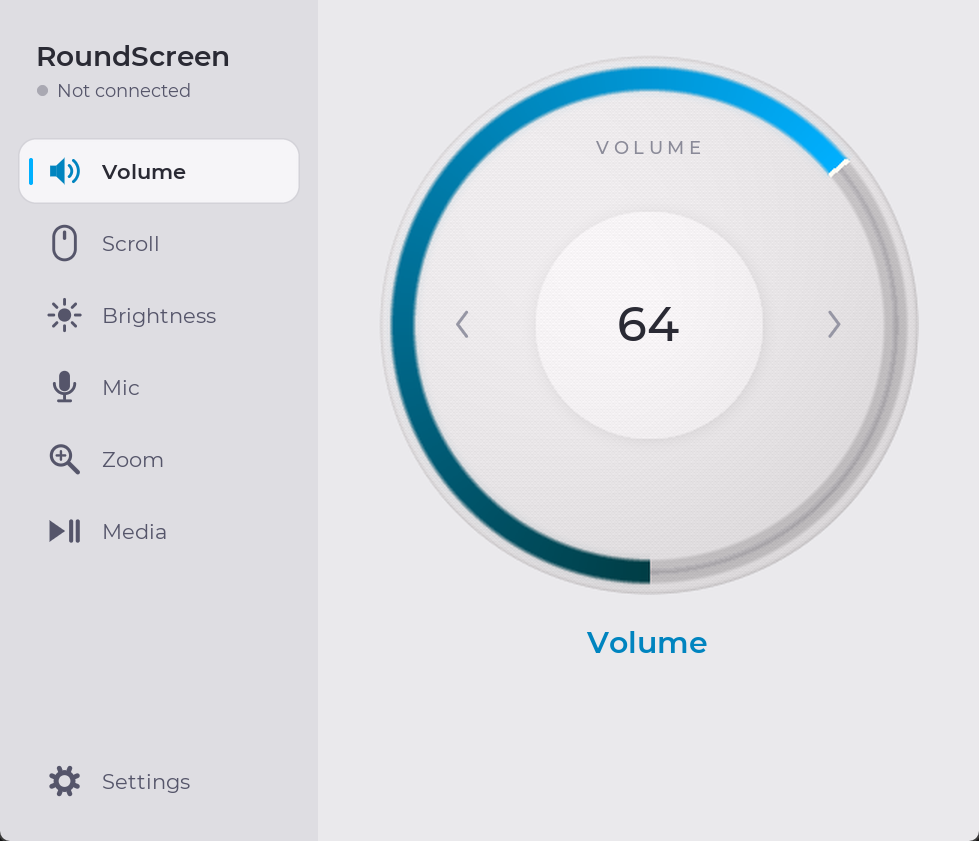
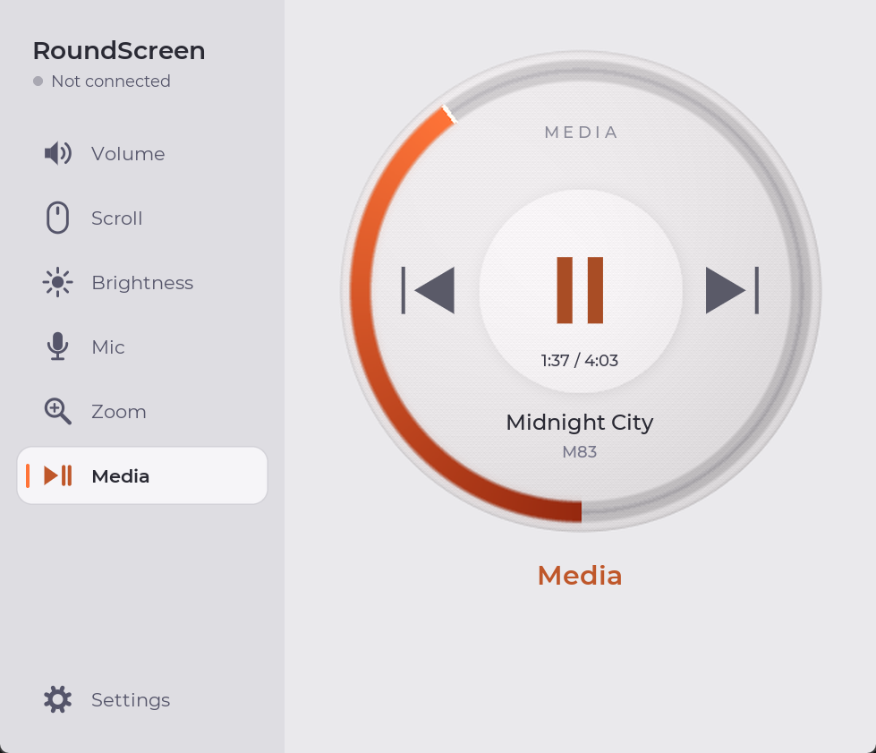
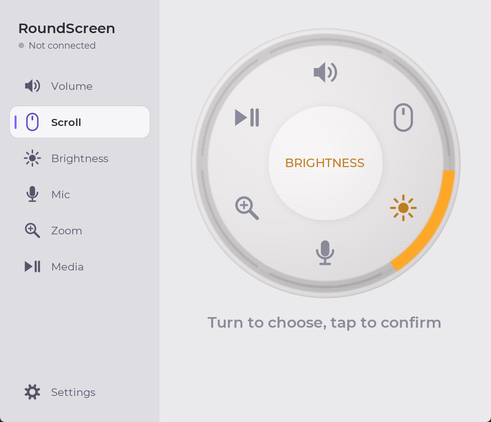
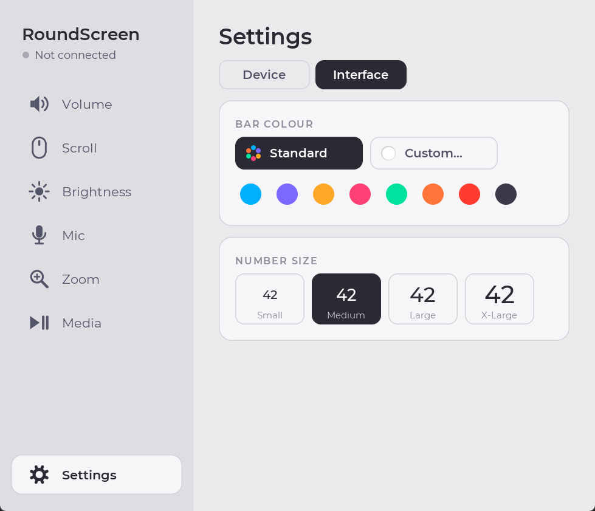

# RoundScreen

**Turn a Waveshare round knob display into a beautiful volume, scroll,
brightness and media controller for Windows.**

[](https://github.com/guilhermelimait/RoundScreen/actions/workflows/ci.yml)
[](LICENSE)


RoundScreen is custom firmware for the
[Waveshare ESP32-S3-Knob-Touch-LCD-1.8](https://www.waveshare.com/wiki/ESP32-S3-Knob-Touch-LCD-1.8)
(a 360 x 360 round AMOLED with a rotary knob and touch) plus a Windows
companion app. The screen and the app draw the same Nest-style dial: a light,
sculpted face with a glowing arc in the control's colour, and they stay in
sync as you turn the knob.

| Volume | Media | Menu | Settings |
| --- | --- | --- | --- |
|  |  |  |  |

*Screenshots of the Windows app; the device shows the same dial.*

## Features

- **Six controls:** system volume, mouse-wheel scrolling, display brightness,
  microphone level, zoom (Ctrl + wheel) and media playback.
- **Media screen** for whatever is playing (Spotify, a browser tab, ...):
  title, artist, progress ring, and big play/pause, previous and next buttons.
  Turning the knob seeks 5 seconds per click.
- **Radial menu:** tap the centre or the mode name, turn to choose, tap to
  confirm. It opens on the control you used last.
- **Always in sync:** the knob, the screen and the app window show the same
  value, and volume changes made elsewhere in Windows show up on the knob.
- **Personalise it:** one colour per control or a single colour of your
  choice, four sizes for the big number, and screen orientation in 90 degree
  steps.
- **Remembers everything** between runs and starts with Windows.

## What you need

- A **Waveshare ESP32-S3-Knob-Touch-LCD-1.8** and a USB-C data cable.
- **Windows 10 or 11.**
- **Python 3.10, 3.11 or 3.12** (64-bit, from [python.org](https://www.python.org/downloads/)).
  Python 3.13 and newer are not supported yet, because the Windows media
  library RoundScreen uses (`winsdk`) has no packages for them.

## Get started

### 1. Download

Download this repository (**Code > Download ZIP**, or `git clone`), and
download `roundscreen-firmware-<version>.bin` from the
[latest release](https://github.com/guilhermelimait/RoundScreen/releases/latest).

### 2. Flash the firmware

The knob's single USB-C socket reaches a **different chip depending on which
way round the plug is inserted**. RoundScreen needs the ESP32-S3, which
Windows lists as a *USB Serial Device* (USB ID `303A:1001`). If it shows up as
a *CH340* port instead, unplug the cable, turn the plug over and plug it back in.

In PowerShell, in the downloaded folder:

```powershell
powershell -ExecutionPolicy Bypass -File .\scripts\flash-firmware.ps1 -Firmware <path to roundscreen-firmware-*.bin>
```

The script installs `esptool`, finds the device, **saves a full backup of
the current flash** to `backups\` the first time, and then writes RoundScreen.
To go back to the original Waveshare firmware later:

```powershell
powershell -ExecutionPolicy Bypass -File .\scripts\flash-firmware.ps1 -Restore .\backups\flash-backup-COM9.bin
```

(Use your own backup file name. Keep it: it is the only copy of the stock
firmware.)

### 3. Install the app

```powershell
powershell -ExecutionPolicy Bypass -File .\install.ps1
```

This installs the Python packages, adds **RoundScreen** to the Start Menu, and
starts it when you sign in to Windows. The shortcuts point to this folder, so
keep it where it is. Launch RoundScreen from the Start Menu: the sidebar shows
**Connected** once the knob answers.

## Using it

**On the device**

- **Turn** the knob to change the current control.
- **Swipe** left or right to switch to the next or previous control.
- **Tap the centre or the mode name** at the top to open the menu. Turn to
  move the highlight, then tap to confirm, or tap an icon directly.
- On the **media** screen, tap play/pause, previous or next.

The knob has no push button.

**In the app**

The dial in the window mirrors the device and accepts clicks the same way.
Pick a control in the left sidebar. **Settings** has two tabs:

- **Device:** the name shown in the sidebar, the list of connected knobs
  (refreshed automatically every two seconds; pick one or leave it on
  **Automatic**), and the screen orientation (0, 90, 180 or 270 degrees).
- **Interface:** **Standard** colours (one per control), a swatch, or
  **Custom...** for any single bar colour; and the number size (Small, Medium,
  Large or X-Large).

Settings are saved in `%LOCALAPPDATA%\RoundScreen\settings.json` straight
away. Volume, microphone and brightness levels are always read from Windows,
never overwritten with old saved values.

## Troubleshooting

- **"Waiting for companion firmware".** The app found a serial port but no
  RoundScreen firmware answered. Flash the firmware (step 2), and check you
  are on the ESP32-S3 side of the USB-C plug.
- **"Not connected" and no device in Settings.** Turn the USB-C plug over, or
  try another cable (some cables only charge).
- **Turning the knob changes nothing.** The screen only shows what the PC
  sends, so the app must be running. The control may also already be at its
  limit (brightness is often at 100%): turn the other way.
- **Brightness does nothing.** Brightness is set through Windows' WMI
  interface, which normally covers built-in laptop screens only. Most external
  desktop monitors are not supported yet.
- **Song titles show "?".** The device fonts only have Latin letters. Accents
  are removed ("Musica" for "Música"); other scripts, such as Japanese,
  show as "?".

## Limitations

- Windows only (it uses Windows audio, brightness and media APIs).
- Brightness works on screens Windows can dim through WMI (usually laptops).
- No album artwork yet: the serial link is line-based text.
- The device stores nothing: the app sends the view and style on every
  connection.

## Development

```powershell
python -m pip install -r requirements.txt
python -m roundscreen.app                    # run from source
python -m unittest discover -s tests -v      # tests
```

- `roundscreen/` is the Windows app (Tk + Pillow). `dial.py` is a Python copy
  of the firmware's dial renderer, so the window matches the screen pixel for
  pixel; keep it in step with `firmware/main/main.c`.
- `firmware/` is the ESP-IDF / PlatformIO project; see
  [firmware/README.md](firmware/README.md) for how to build it and how the
  renderer, encoder and touch handling work.
- GitHub Actions runs the tests and builds the firmware on every push. Pushing
  a `v*` tag publishes a release with the merged firmware image.

## Protocol

USB serial: 115200 baud, ASCII lines terminated by `\n`.

| Direction | Message | Meaning |
| --- | --- | --- |
| Device to PC | `HELLO,ROUNDSCREEN,1` | Companion handshake |
| Device to PC | `ROT,<signed steps>` | Knob movement |
| Device to PC | `MENU` | Centre or mode-name tap opens the menu |
| Device to PC | `TAP,<0..5>` | Menu choice confirmed |
| Device to PC | `CURSOR,<0..5>` | Knob moved the menu highlight |
| Device to PC | `SWIPE,LEFT` or `SWIPE,RIGHT` | Change control |
| PC to device | `STATE,<MODE>,<0..100>,<0\|90\|180\|270>` | Set screen state |
| PC to device | `SHOWMENU` | Show radial menu |
| PC to device | `COMETRESET` | Put the scroll/zoom comet back at its start (sent on connect) |
| PC to device | `STYLE,<STANDARD\|RRGGBB>,<24\|32\|40\|48>` | Bar colour and number size |
| Device to PC | `MEDIA,PREV\|PLAYPAUSE\|NEXT` | Transport icon tapped |
| PC to device | `TRACK,<title>` | Now-playing title |
| PC to device | `ARTIST,<artist>` | Now-playing artist |
| PC to device | `PLAY,<0\|1\|2>,<position s>,<duration s>` | Playback state (0 stopped, 1 playing, 2 paused) |

Mode names, in sector order: `VOLUME`, `SCROLL`, `BRIGHTNESS`, `MIC`, `ZOOM`,
`MEDIA`. The preview uses a neutral midpoint for non-percentage controls.

Each knob detent sends exactly one step. The encoder is not a quadrature
encoder and emits two pulses per detent, which the firmware divides down; see
`firmware\README.md` for the details.


## Licence

RoundScreen is released under the [MIT License](LICENSE). Bundled and
downloaded third-party components keep their own licences; see
[THIRD_PARTY_NOTICES.md](THIRD_PARTY_NOTICES.md). This project is not
affiliated with Waveshare or Espressif.
