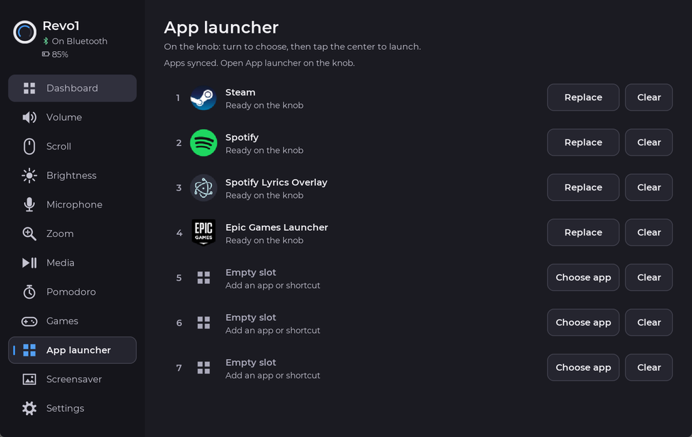
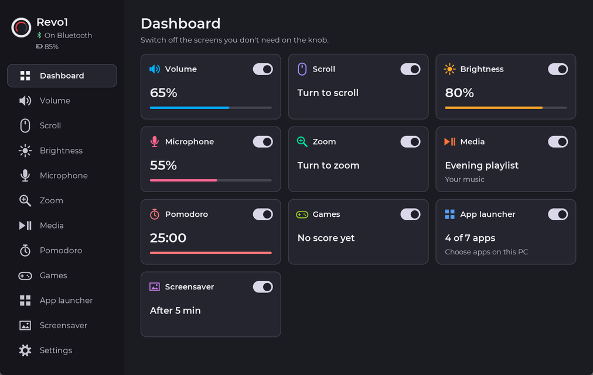
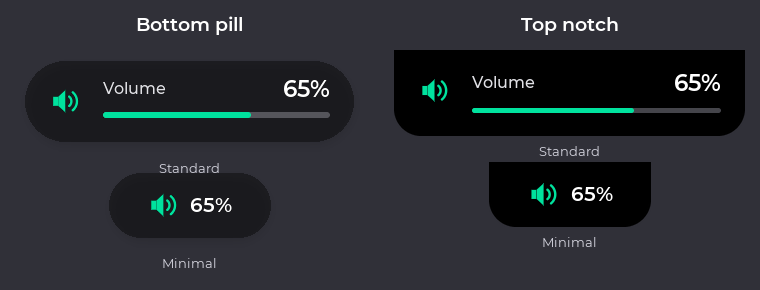
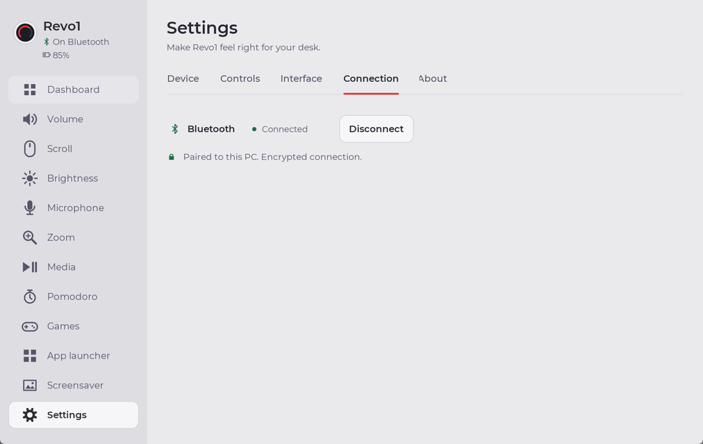

# Revo1 1.1.0

**Your round controller, now more personal, useful and polished.**

This release brings together the changes since 1.0.1 on both the Windows
companion and the device. Install the matching app and firmware to use all
features, particularly transparent launcher icons.

## Launch your apps from the knob

- Choose up to seven desktop or Microsoft Store apps.
- Find apps in a searchable picker, or browse for an executable or shortcut.
- See every configured icon around the device face. Turn to select, tap the
  centre to launch, or tap an icon directly.
- Back always has its own space at the top; the selected app name stays centred.
- Icons preserve their original transparency in both themes. No added tile
  backgrounds; the coloured ring still identifies your selection.
- Only names and icons go to the device. App paths stay on your PC.

## Light, Dark and System

Choose one appearance for the companion and round display. System follows
Windows automatically. App artwork, photos and your chosen clock colours
keep their original colours.

Buttons, fields, typography, tabs and spacing now follow a consistent visual
language. Colour swatches stay circular, with a clear selection ring.

## Desktop feedback your way

- **Bottom pill:** a small, translucent black overlay above the taskbar.
- **Top notch:** a small, opaque black overlay attached to the top centre.
- **Standard:** control label, value and a progress bar when meaningful.
- **Minimal:** just the icon and smaller value, centred together without a badge.
- Select which actions appear: volume, brightness, microphone, scroll, zoom,
  media, Pomodoro, game scores and app launches.

Feedback appears during Revo1 changes and disappears afterwards. It works while
the app is in the tray, does not take focus, and lets clicks pass through.

## Easier Settings and connections

All five Settings tabs have clearer grouping, readable help/errors, fixed tabs
above scrolling content, keyboard navigation and focus-aware scrolling.

- Device name is first; fresh installations start as **Revo1**.
- Connection shows only Bluetooth, with compact **Connect / Disconnect** controls.
- Disconnect keeps pairing so you can reconnect without forgetting the device.
- USB detection checks the actual companion greeting, including when another
  ESP32 is connected. Bluetooth retries and discovery failures are handled clearly.
- **Center text size** replaces Number size.
- About text wraps with enough space to avoid clipping.

## More to do on the round screen

- **Whack-a-Mole:** rotary aiming, touch to whack, gold moles, bombs and saved
  last/best scores.
- **Screensavers:** pictures, GIFs, videos, a date/time clock, or time over
  pictures; 12/24-hour choices, clock colours and optional picture shading.
- **Eleven seconds-ring choices**, including Walker, Snake, Sparkle, Orbit and
  Heartbeat. Ring colour follows the time colour.
- A new centred **Moon** starter picture; improved scrolling and wider choices
  keep screensaver controls usable.
- **Pomodoro:** turn to adjust an active timer by one minute per click; phase
  and timer icon are better positioned.
- **Media:** improved fallback for players without Windows media controls,
  including elapsed time and player-key seeking.
- **Ring styling:** Glowing tip, Fade to solid, Soft gradient or Solid, with a
  cleaner full-ring transition at 100%.

## Power and reliability

Battery icons sit beside the estimated percentage during Bluetooth use.
USB power is labelled on the PC dashboard without claiming charging status.
Invalid or stale battery estimates are hidden.

Manual **Battery Saver** caps brightness, dims after inactivity and switches
off the display after five minutes; touch or turn wakes it. Animation work is
reduced while saving power and stops when the display is dark.

Reconnecting opens the device's main menu rather than unexpectedly jumping to
Volume. External value updates no longer close an open menu.

## Download and upgrade

Get the files from the [1.1.0 release](https://github.com/guilhermelimait/Revo1/releases/tag/v1.1.0):

- **Windows x64:** `Revo1-Setup-1.1.0.exe`
- **Windows ARM64:** `Revo1-Setup-1.1.0-arm64.exe`
- **Round display:** `revo1-firmware-1.1.0.bin`

Install over your existing app to keep preferences and app choices. Update the
firmware over USB from About or with the repository's flashing script.
Wireless is **Bluetooth only**; Wi-Fi configuration from older versions is
removed. The swipe option is no longer shown, but existing saved behaviour is
retained. Battery percentages remain estimates, not calibrated charge readings.

The installer is not yet code-signed. Windows SmartScreen may require
**More info > Run anyway**.

Hardware: [Waveshare ESP32-S3 rotary touchscreen on Amazon](https://link.amazon/B061NfG3G).
This is an affiliate link; qualifying purchases support the project at no
extra cost to you.

For the full details, see the [changelog](../../CHANGELOG.md) and
[setup guide](../../README.md).
